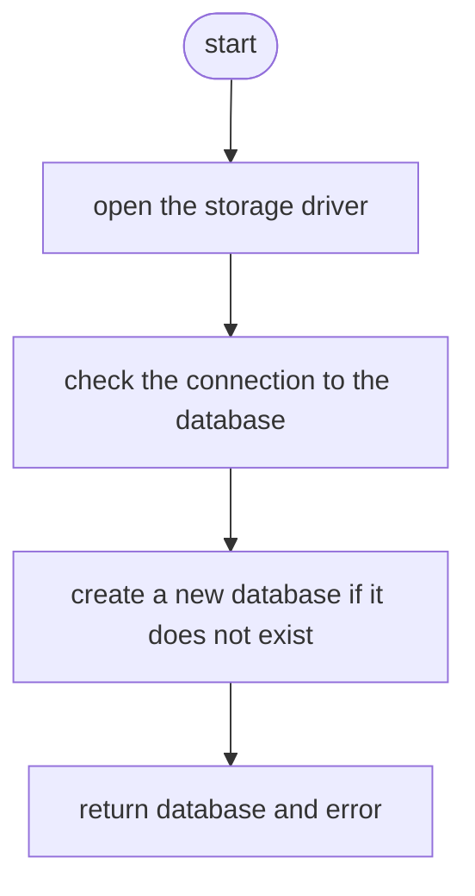

# Storage Architecture

## Open

```mermaid
flowchart TD

start([start])
open[open the storage driver]
check[check the connection to the database]
query[create a new database if it does not exist]
return[return database and error]

start --> open --> check --> query --> return
```
